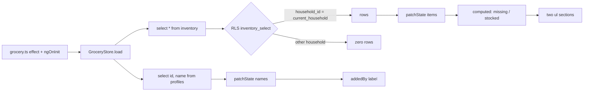
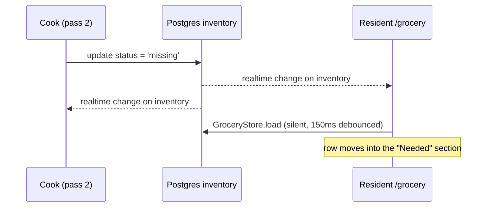
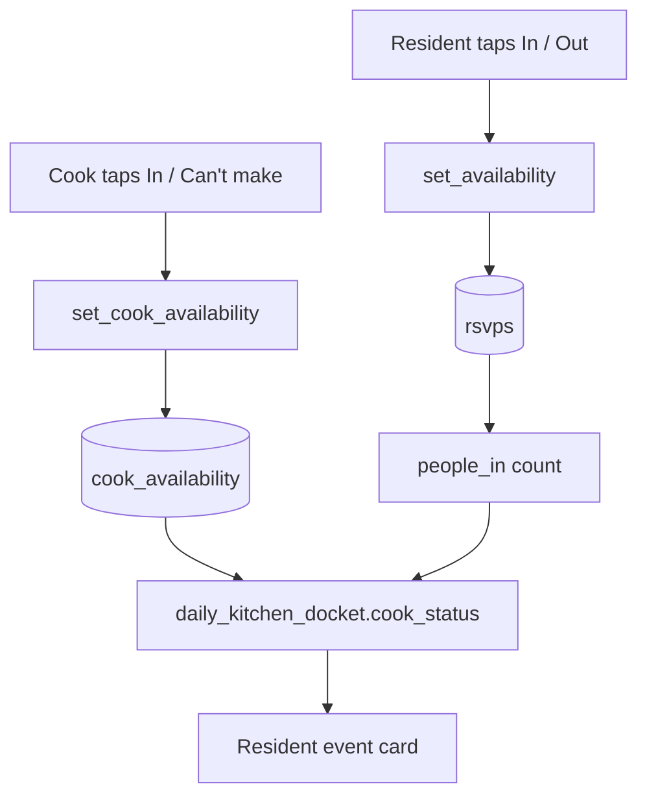

# Data Flow

How data moves through the code touched by each session. Newest session first.

---

## 2026-09-22 — Resident a11y + shell restructure, grocery list, cook dashboard design

**Status.** The resident pass is built. Everything below describes code in the repo unless
it is explicitly marked **planned** (the cook dashboard, which has no code yet).

### The UI layer

`@cooklog/ui` is ZardUI, vendored as source under `packages/ui/src/lib/zard/` (shadcn model:
the code is ours to edit), plus three components ZardUI has no equivalent for — `UiField`,
`UiStat` and `UiStepper` — which are themselves built on ZardUI primitives.

| Concern | Where |
| --- | --- |
| Variants | `class-variance-authority` + `mergeClasses` (`clsx` + `tailwind-merge`) |
| Overlays (dropdown) | `@angular/cdk/overlay` — content renders into `document.body`, **not** inside the component |
| Event modifiers | `provideZard()` in `app.config.ts` registers the plugins behind `(click.prevent-with-stop)` |
| Icons | `@ng-icons/lucide`, via a curated 9-icon registry (see D12) |
| Colour | unchanged — ZardUI uses the same shadcn variable contract our tokens already define |

Two consequences worth knowing when writing tests:

- Dropdown content is **not** a descendant of the component under test. Specs query
  `document`, and must `provideZard()` or the trigger's click handler never fires.
- ZardUI closes a dropdown on a `setTimeout(…, 0)`, which `fixture.whenStable()` does not
  await in zoneless mode; a spec asserting the close must flush a macrotask.

### The data-access boundary

No Node API server exists. The backend is Supabase Postgres reached over PostgREST;
`security definer` RPCs carry anything that needs privilege. `COLLABORATION.md` forbids
pages from importing `@supabase/supabase-js` or calling `client.from()` — every read and
write goes through an `@ngrx/signals` store in `packages/data-access/src/lib/`.

| Store | Reads | Writes |
| --- | --- | --- |
| `auth.store.ts` | `profiles`, `households` | `create_household`, `join_household`, `set_active_household` RPCs |
| `events.store.ts` | `meals`, `rsvps`, `event_entries`, `profiles(id,name)` | `create_meal_event`, `set_availability` RPCs; direct `event_entries` insert/update/delete |
| `catalog.store.ts` | `items`, `regulars` | `items` insert; `regulars` insert/update/delete |
| `docket.store.ts` | `daily_kitchen_docket`, `docket_items` views | none — read-only |
| **`grocery.store.ts`** (new) | `inventory`, `profiles(id,name)` | `inventory` insert/update(`status`)/delete |

Two cross-cutting mechanisms every store uses:

- **Household scoping.** Almost every RLS policy reduces to
  `household_id = public.current_household()`. That function returns
  `profiles.active_household_id` *only if* a matching `household_members` row exists, so a
  stale active id fails closed. Pages re-run `load()` in an `effect()` keyed on
  `AuthStore.activeHouseholdId()`.
- **Realtime.** `realtime.ts` exports `watchTables(client, channel, tables, onChange)` with
  a 150 ms debounce. Components subscribe in `ngOnInit` and unsubscribe via
  `destroyRef.onDestroy(store.watch())`.

Writes follow one optimistic shape, `optimistic()` at `events.store.ts:113-127` and mirrored
in `grocery.store.ts`: snapshot, patch the signal, run the mutation, and revert on **either**
an error **or** a zero-row result. Zero rows means RLS silently rejected the write, which is
indistinguishable from "locked" at the client, so both surface the same way.

### Grocery list — read path

`GroceryStore` is modelled on `catalog.store.ts`, including its Postgres `23505`
duplicate-name handling.

| Member | Type | Notes |
| --- | --- | --- |
| `items` | `GroceryItem[]` | `GroceryItem = Tables['inventory']['Row']` |
| `names` | `Record<string, string>` | profile id → display name, for "Added by …" |
| `loading` | `boolean` | drives the `role="status"` region |
| `missing` | computed | `status === 'missing'`, name-sorted — rendered first |
| `stocked` | computed | `status === 'stocked'`, name-sorted |

`Grocery.addedBy()` resolves three cases in order: no `added_by` → "Added when the household
was set up" (rows seeded before this migration); `added_by === auth.userId()` → "Added by
you"; otherwise the name from `names()`, falling back to a generic phrase if the profile is
not visible.

### Grocery list — write paths

All three go through the store's `optimistic()` helper except `add`, which needs the inserted
row back to learn its server-generated `id`.

| Action | Entry point | Mutation | Failure handling |
| --- | --- | --- | --- |
| Add | form `(ngSubmit)` → `add()` | `insert` with `added_by = auth.uid()`, `status = 'missing'` | `23505` → "That item is already on the list"; the unique index is `(household_id, lower(name))`, so it is case-insensitive |
| Toggle | checkbox `(change)` → `toggle()` | `update status` | error or zero rows → revert, `role="alert"` |
| Remove | `✕` button → `remove()` | `delete` | error or zero rows → revert, `role="alert"` |

`added_by` is set client-side and re-checked by the insert policy
(`added_by = (select auth.uid())`), so a forged value is rejected rather than trusted —
asserted by `supabase/tests/pantry.test.sql`.

Column grants are the real write surface: `insert (household_id, name, status, added_by, note)`
and `update (status, note)`. A client cannot move a row between households or backdate
`created_at`, independently of the policies.

### Grocery list — realtime fan-out

`inventory` was already in the `supabase_realtime` publication (migration 1), so the pantry
migration adds no publication entry. Both roles watching the same household converge:

Ordering caveat: the writer applies its optimistic patch **before** the realtime echo
arrives, then the debounced `load({silent:true})` overwrites it with server truth. A rejected
write reverts locally and never produces an echo.

### `updated_at` is transaction time

The `inventory_touch` trigger sets `updated_at := now()`, the **transaction** timestamp. Two
writes inside one transaction therefore share an `updated_at`; only a new transaction moves
it. This is why the pgTAP fixture inserts its rows aged by a day — see D9 in `decisions.md`.

### Navigation rendering

Three surfaces render navigation, selected by role and viewport:

| Surface | Condition | Contents |
| --- | --- | --- |
| Header nav (`app-shell.ts`) | resident **and** `≥sm` (`hidden sm:flex`) | Events, Grocery, Regulars |
| Bottom nav (`bottom-nav.ts`) | resident (`@if showBottomNav()`) **and** `<sm` (`sm:hidden`) | Events, Grocery, Regulars |
| `⋮` more-menu (`app-shell.ts`) | any authenticated role | copy invite code (residents only), theme, sign out |

Active state is conveyed twice on every surface: colour via `routerLinkActive`, and
`aria-current="page"` bound from the `#ref="routerLinkActive"` template reference. `AppShell`
adds `pb-28 sm:pb-4 md:pb-8` to `<main>` only when the bottom bar is rendered, via the
`mainClass()` computed, so the fixed bar never covers the last card.

The household switcher stays outside the more-menu — it is a primary control and owns its own
`UiDropdown`.

`/grocery` is routed inside the `AppShell` children with **no `roleGuard`**, because the
pantry is shared household state that the cook writes to in pass 2.

### Focus and announcement flows

None of this existed before: the repo had no `.focus()` call, no `autofocus`, and exactly one
`aria-live` region (`stepper.ts:13`).

| Trigger | Flow |
| --- | --- |
| First `Tab` on load | skip link reveals (`sr-only` → `focus:not-sr-only`) → activating it jumps to `<main id="main-content" tabindex="-1">` |
| `NavigationEnd` | `provideRouteFocus()` (`core/focus.ts`) moves focus to `#main-content`. The first navigation is skipped, so a fresh load does not steal focus |
| Dropdown opens | ZardUI moves focus into the panel; rows are `role="menuitem"` `tabindex="-1"`, so the menu is not in the tab order |
| Dropdown keys | `ArrowDown`/`ArrowUp` rove, `Home`/`End` jump, `Escape` closes and restores focus to the trigger — ZardUI's own implementation, equivalent to the one it replaced |
| Segmented keys | roving tabindex from `activeIndex()`: the checked option is `tabindex="0"`, the rest `-1`, so the group is one tab stop. `ArrowLeft/Right/Up/Down` select and wrap; `Home`/`End` jump; all ignored while `disabled()` |
| Invite code copied | `AppShell.copyCode()` writes a sentence into `status()`, rendered in an `sr-only` `role="status" aria-live="polite"` region and cleared after 4 s. The `catch` now reads the code aloud instead of failing silently, which is what happens on a non-secure origin |
| Field error | `UiField.errorId()` yields `<for>-error`; `event-create.ts` points the title input's `aria-describedby` at it and sets `aria-invalid` |
| Store loading | `role="status"` on the loading paragraph in `resident-home.ts`, `event-detail.ts`, `cook-home.ts` and `grocery.ts` |

ZardUI's dropdown implements the full menu keyboard contract, so migrating to it kept the
behaviour the hand-rolled `UiDropdown` had gained, rather than regressing it.

### Planned (pass 2): cook availability

**No code exists for this.** The design is deliberately parallel to, and disjoint from, the
resident RSVP flow:

The two paths meet only inside the view, and `people_in` counts `rsvps` alone. That
separation is the point of D5: putting the cook in `rsvps` would inflate the number the cook
is cooking for.

The cook's missing-ingredient grid needs no new database work — the pantry migration already
grants insert/update/delete to any household member, and `pantry.test.sql` asserts the cook
path.
